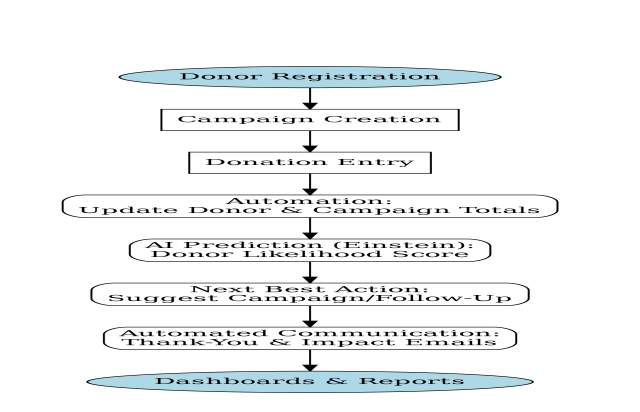
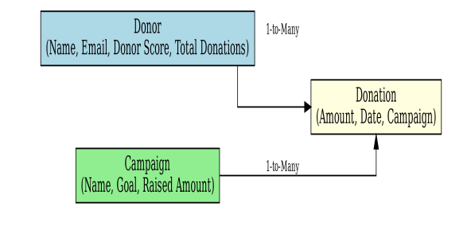

# 🌍 AI-Powered NGO Donation & Impact Management System

## 📌 Overview
A Salesforce CRM that helps NGOs manage donors, track donations, run campaigns, and measure impact — all in one place.  
Uses **Einstein AI** (in future phases) for donor scoring and campaign recommendations.

---

## 🎯 Problem
NGOs face challenges like:
- Missed or untracked donations  
- Duplicate donor records  
- No automated follow-up or thank-you process  
- Difficulty showing donors how funds are used  
- Lack of real-time reports for decision-making  

---

## 💡 Solution
Our Salesforce solution:
- Centralizes donor data  
- Tracks donations & auto-generates receipts  
- Sends instant thank-you emails/SMS  
- Manages campaigns & shows progress in real-time  
- Provides dashboards for quick insights  

---

## 📌 Project Phases

### Phase 1 ✅ – Requirement Gathering & Analysis
- Stakeholder analysis  
- Business process mapping  
- Data model design (Donor, Donation, Campaign objects)

 
---

## 🛠 Tech Stack
Salesforce | Profiles & Roles | Permission Sets | OWD | Sandbox | Deployment Basics  

---

## 📊 Visuals
  

